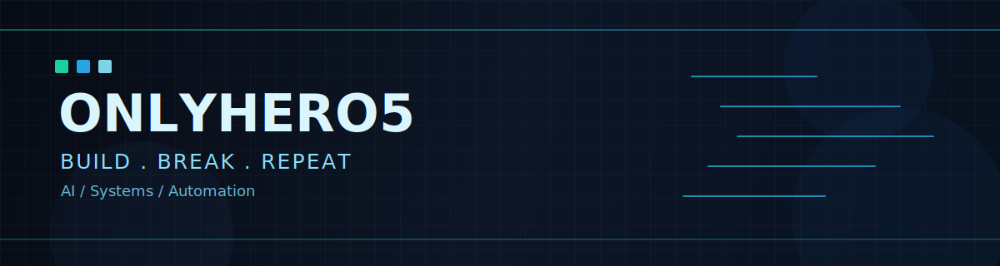

# <div align="center">Hi there, I'm PSX</div>

<div align="center">
  
</div>

<div align="center">
  
</div>

<div align="center">
  <a href="https://github.com/OnlyHero5">
    
  </a>
  <a href="https://github.com/OnlyHero5?tab=followers">
    
  </a>
  <a href="https://github.com/OnlyHero5?tab=repositories">
    
  </a>
</div>

---

## About Me

- Name: `PSX`
- Focus: `AI infra`, `systems experiments`, `practical automation`
- Recent keywords: `vLLM repro`, `SkyRL`, `wxapp check-in`
- Motto: `Build, break, learn, repeat.`

## Skill Matrix

<div align="center">
  
  
  
  
  
  
  
  
  
</div>

## Featured Repositories

<table>
  <tr>
    <td width="50%" valign="top">
      <a href="https://github.com/OnlyHero5/wxapp-checkin"><b>wxapp-checkin</b></a><br/>
      活动签到小程序。<br/><br/>
      
      
      
    </td>
    <td width="50%" valign="top">
      <a href="https://github.com/OnlyHero5/nano_vllm_repro"><b>nano_vllm_repro</b></a><br/>
      小型 vLLM 复现与实验项目。<br/><br/>
      
      
      
    </td>
  </tr>
  <tr>
    <td width="50%" valign="top">
      <a href="https://github.com/OnlyHero5/nano_skyrl"><b>nano_skyrl</b></a><br/>
      强化学习相关的轻量实验仓库。<br/><br/>
      
      
      
    </td>
    <td width="50%" valign="top">
      <a href="https://github.com/OnlyHero5/assignment2-systems"><b>assignment2-systems</b></a><br/>
      系统课程项目，聚焦 Python 工程实践。<br/><br/>
      
      
      
    </td>
  </tr>
</table>

## Activity Grid

<div align="center">
  
</div>

## Current Status

```text
Learning:   RL + LLM serving internals
Building:   Practical automation and mini-app tools
Exploring:  Performance, reliability, and clean engineering workflows
```

<div align="center">
  <sub>Last updated: 2026-02-06</sub>
</div>
